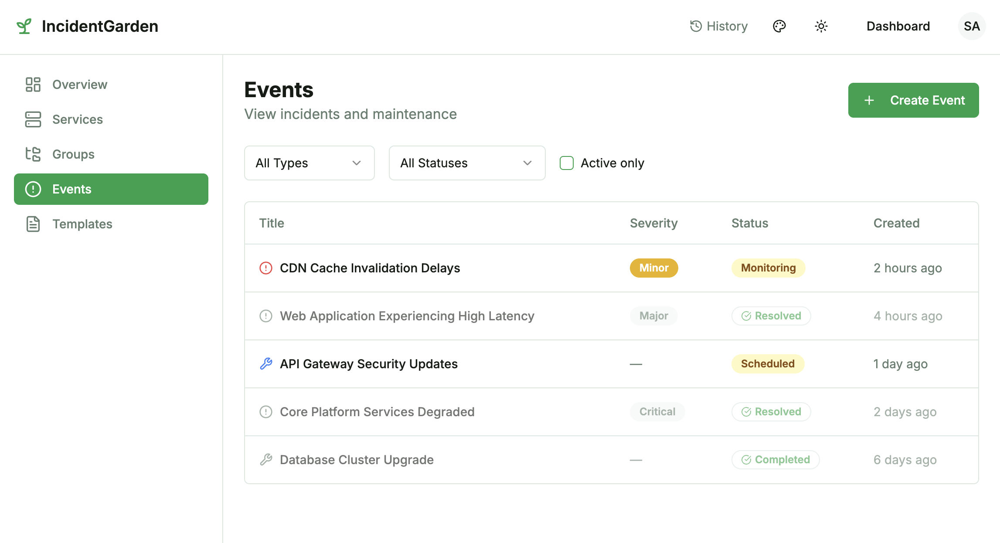
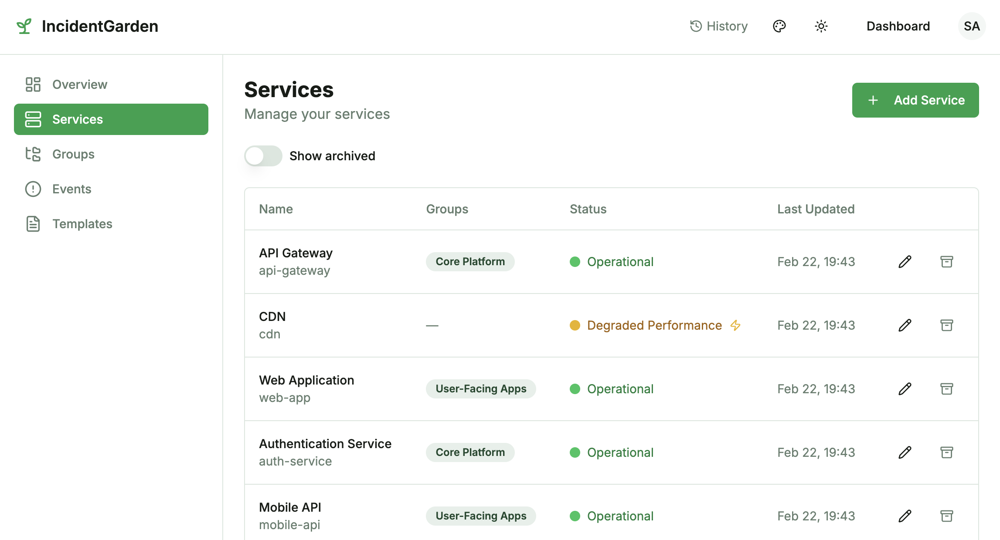

# Garden UI

Web interface for [Incident Garden](https://github.com/bissquit/incident-garden) — an open-source status page and incident management system. Communicate service status to your users through a clean public page, and manage incidents through an operator dashboard.

<p align="center">
  
</p>

## Why Garden

Most open-source status page tools focus on **uptime monitoring** (pinging endpoints). Garden focuses on **incident communication** — the part where you tell your users what's happening, what's affected, and when it will be fixed.

- **Structured incident lifecycle** — Create, update, and resolve incidents with timeline history. Track affected services and their status changes throughout the incident. Most alternatives (Uptime Kuma, Gatus) have no real incident workflow.
- **Role-based access control** — Three roles: user, operator, admin. Operators manage incidents, admins configure the system. Most open-source alternatives have no multi-user support.
- **Notification subscriptions** — Users subscribe to specific services via Email, Telegram, or Mattermost. Not "all or nothing."
- **Lightweight infrastructure** — Go backend + PostgreSQL. No PHP, no Redis, no Elasticsearch. Single `docker compose up` to run everything.
- **Public page + operator dashboard** — Your users see a clean status page. Your team sees a full management dashboard with filters, templates, and service groups.

<details>
<summary>Dashboard screenshots</summary>

**Events management:**


**Services management:**


</details>

## Quick Start

Try the full stack locally with Docker — no build steps, no Node.js required:

```bash
# Download the quickstart compose file
curl -O https://raw.githubusercontent.com/bissquit/garden-ui/main/docker-compose.quickstart.yml

# Start all services (postgres + backend + frontend)
docker compose -f docker-compose.quickstart.yml up -d
```

Once all containers are healthy:

- **Status page:** [http://localhost:3000](http://localhost:3000) — public, no auth required
- **API:** [http://localhost:8080](http://localhost:8080) — backend REST API

The quickstart comes with demo data: services, groups, incidents, and maintenance events — so you can explore the UI right away.

### Default Accounts

The backend migrations seed three accounts with different roles:

| Role     | Email                  | Password   |
|----------|------------------------|------------|
| admin    | `admin@example.com`    | `admin123` |
| operator | `operator@example.com` | `admin123` |
| user     | `user@example.com`     | `user123`  |

Log in at [http://localhost:3000/login](http://localhost:3000/login) — use the **admin** or **operator** account to access the dashboard.

### Enabling Notifications

Email and Telegram notifications are disabled by default. To enable them, uncomment and configure the corresponding environment variables in `docker-compose.quickstart.yml` (see the `# --- Notifications ---` section in the backend service). Without these, only in-app notification channels will be available.

### Stop

```bash
# Stop containers (data preserved)
docker compose -f docker-compose.quickstart.yml down

# Stop and remove all data
docker compose -f docker-compose.quickstart.yml down -v
```

## Features

### Public Status Page
- Overall system status banner
- Active incidents with severity and timeline
- Scheduled maintenance announcements
- Service list grouped by category
- 7-day status history
- Individual event detail pages

### Operator Dashboard
- **Services** — CRUD with status management, grouping, tags, archive/restore
- **Groups** — Organize services into logical categories
- **Events** — Incidents and maintenance with full lifecycle (investigating → identified → monitoring → resolved)
- **Templates** — Reusable event templates for common incidents
- **Event updates** — Timeline entries with per-service status changes

### Notifications
- **Channels** — Email, Telegram, Mattermost (with verification)
- **Subscriptions** — Per-channel, per-service subscription matrix
- User self-service via Settings page

### Themes
Four color themes (Garden, Ocean, Sunset, Forest), each with light and dark mode. Preference saved in browser.

## Architecture

Garden is a two-component system:

| Component         | Repository                                                      | Stack                                           |
|-------------------|-----------------------------------------------------------------|-------------------------------------------------|
| **Backend (API)** | [incident-garden](https://github.com/bissquit/incident-garden)  | Go, PostgreSQL, REST API                        |
| **Frontend (UI)** | this repo                                                       | Next.js 14, TypeScript, Tailwind CSS, shadcn/ui |

The frontend is a standalone Next.js application that communicates with the backend API. Authentication uses HTTP-only cookies managed by the backend.

### Tech Stack

| Layer      | Technology                |
|------------|---------------------------|
| Framework  | Next.js 14 (App Router)   |
| Language   | TypeScript                |
| Styling    | Tailwind CSS + shadcn/ui  |
| State      | TanStack Query v5         |
| Forms      | React Hook Form + Zod     |
| API Client | openapi-fetch (type-safe) |
| Testing    | Vitest + Playwright       |

## Development

### Prerequisites

- Node.js 20+
- Backend API running (see [docker-compose.yml](docker-compose.yml) or [incident-garden](https://github.com/bissquit/incident-garden))

### Setup

```bash
git clone https://github.com/bissquit/garden-ui.git
cd garden-ui
npm install
cp .env.example .env.local
npm run dev
```

Open [http://localhost:3000](http://localhost:3000). The app expects the backend at `http://localhost:8080` by default (configured via `NEXT_PUBLIC_API_URL`).

### Commands

```bash
npm run dev              # Dev server on :3000
npm run verify           # Lint + typecheck + test + build (CI parity)
npm run test:run         # Unit and integration tests
npm run test:e2e         # E2E tests (Playwright, headless)
npm run test:e2e:ui      # E2E tests with interactive UI
npm run api:update       # Download OpenAPI spec from backend + regenerate types
```

### Testing

Coverage threshold: **70%** (statements, branches, functions, lines).

```bash
npm run test:coverage    # Run tests with coverage report
npm run test:e2e         # E2E tests (requires running backend)
```

## Compatibility

| Frontend | Backend | Notes |
|---|---|---|
| 1.5.x | >= 2.11.0 | Current |

Check [incident-garden releases](https://github.com/bissquit/incident-garden/releases) for backend versions.

## Limitations

- **No built-in monitoring** — Garden manages incidents, not uptime checks. Use it alongside your existing monitoring (Prometheus, Grafana, Uptime Kuma, etc.)
- **Frontend and backend are separate deployments** — you need both running
- **Registration is API-only** — the UI registration page is disabled; accounts are created via API or by an admin
- **NEXT_PUBLIC_API_URL is a build-time variable** — to change the backend URL, rebuild the frontend Docker image with the new value
- **NEXT_PUBLIC_SITE_NAME is a build-time variable** — set it to customize the site name for branding (default: `IncidentGarden`)

## Contributing

See [CLAUDE.md](./CLAUDE.md) for development guidelines, architecture decisions, and coding conventions.

```bash
# Run full validation before submitting a PR
npm run verify
```

## License

[Apache License 2.0](LICENSE)
